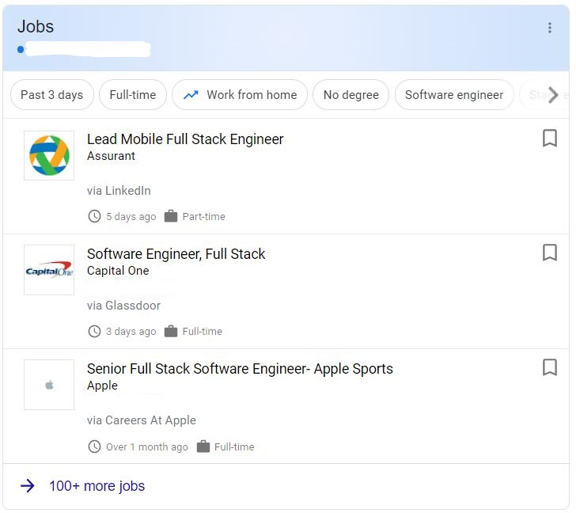

# Mintbean's list of Job Boards for Junior Developers

This list is graciously maintained by [Jonathan Chan](https://github.com/JC-008), a member of the Mintbean Community.

P.S. Jonathan is looking for work as a Jr. Web Dev! You can hire Jonathan by reaching out to him here:

* [LinkedIn](https://www.linkedin.com/in/jonathan-chan8/)
* [Portfolio](https://jc-008.github.io/)
* [Github](https://github.com/JC-008)

# Mainstream Boards

* [LinkedIn Jobs](https://www.linkedin.com/jobs/) : You'll need to join and sign in with LinkedIn.
* [Indeed](https://www.indeed.com ) : You'll need to join and sign in with Indeed.
* [Zip Recruiter](www.ziprecruiter.com) : You'll need to join and sign in with Zip Recruiter.
* [Monster](https://www.monster.com/) : You'll need to join and sign in with Monster.
* [Glassdoor](https://www.glassdoor.com) : You'll need to join and sign in with Glassdoor.

# Smaller Job Boards

* [The Muse](https://www.themuse.com) : You'll need to join and sign in with themuse to use properly.
* [AngelList](https://www.angellist.com/) :  You'll need to join and sign in with AngelList to use properly. - A great resource for startups!
* [BuiltIn](https://builtin.com/) : You'll need to join and sign in with BuiltIn to use properly. You can view on the bottom of the page for specific Tech hubs in the US.

### <b>Other resources</b>
* Google Search - You can use google and search for the job position you want. There should be a menu that you can select and it will bring you to a specific google search page.
  * <b><i>See below for an example</i></b>

    

### <i>If there are any job board(s) you think that will help this club or the community, please reach out to me for details to add to this repo!</i>
